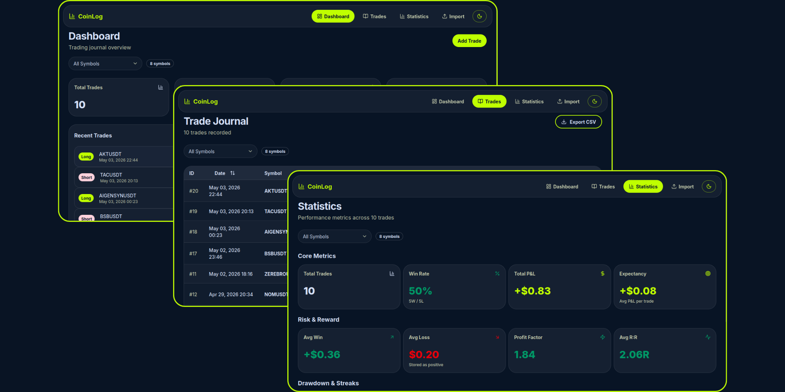

# CoinLog

[](https://www.gnu.org/licenses/gpl-3.0)
[](https://nextjs.org)
[](https://www.typescriptlang.org)

**A privacy-first, local-only crypto trading journal and analytics web application.**

---



## ✨ Features

### Core Features

- 📝 **Manual Trade Entry** — Log trades with full annotation (setup type, R:R, stop loss, take profit, market conditions, notes)
- 📥 **Bybit Integration** — Import closed PnL trades directly from Bybit exchange via API
- 📄 **CSV Import/Export** — Bulk import from CSV, export all trades for backup/analysis
- 📊 **Statistics Dashboard** — Win rate, PnL, profit factor, max drawdown, average R:R, win/loss streaks, monthly breakdown
- 🔍 **Trade Management** — Filter by symbol/exchange, sort by any column, search, annotate, delete
- 🎨 **Dark/Light Mode** — Beautiful UI with theme support

### Privacy & Security

- 🔒 **Local-First Storage** — All trade data stored in your browser via IndexedDB (nothing leaves your device)
- 🔐 **Client-Side Encryption** — API keys encrypted with AES-GCM + PBKDF2 (600k iterations) before storage
- 🛡️ **Security Headers** — CSP, rate limiting, API authentication, CSRF protection, input validation
- 🚫 **No Tracking** — No analytics, no telemetry, no cookies (except theme preference)

---

## 🚀 Quick Start

### Prerequisites

- Node.js 20+
- npm, yarn, pnpm, or bun

### Installation

```bash
# Clone the repository
git clone https://github.com/Crypto-Finance/CoinLog.git
cd CoinLog

# Install dependencies
npm install

# Run development server
npm run dev
```

Open [http://localhost:3000](http://localhost:3000)

### Environment Variables (Optional)

```bash
# Copy example env file
cp .env.example .env

# For production rate limiting (optional - falls back to in-memory)
UPSTASH_REDIS_REST_URL=your_upstash_url
UPSTASH_REDIS_REST_TOKEN=your_upstash_token

# For API route authentication (recommended for production)
API_ROUTE_SECRET=generate_with_openssl_rand_-hex_32

# Site URL for CSRF protection
NEXT_PUBLIC_SITE_URL=https://your-domain.com
```

---

## 📚 Documentation

- **[Usage Guide](docs/usage.md)** — How to use CoinLog (manual entry, imports, statistics, export)
- **[Architecture](docs/architecture.md)** — Technical architecture, tech stack, and security design
- **[Development](docs/development.md)** — Development workflow, testing, and contributing guidelines
- **[Deployment](docs/deployment.md)** — Deployment options (Vercel, self-hosting, Docker)

---

## 🤝 Contributing

Contributions are welcome! Please follow these guidelines:

1. **Fork the repository**
2. **Create a feature branch** (`git checkout -b feature/amazing-feature`)
3. **Commit your changes** (`git commit -m 'Add amazing feature'`)
4. **Push to the branch** (`git push origin feature/amazing-feature`)
5. **Open a Pull Request**

### Code Standards

- TypeScript strict mode compliance
- Follow existing code patterns (SRP, DRY, KISS)
- Add tests for new features
- Update documentation as needed
- Run `npm run lint` and `npm test` before submitting

---

## 📄 License

This project is licensed under the **GNU General Public License v3.0 (GPL-3.0)** — see the [LICENSE](LICENSE) file for details.
